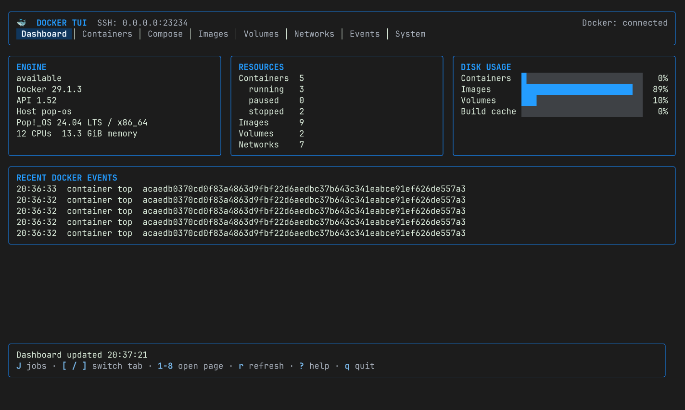
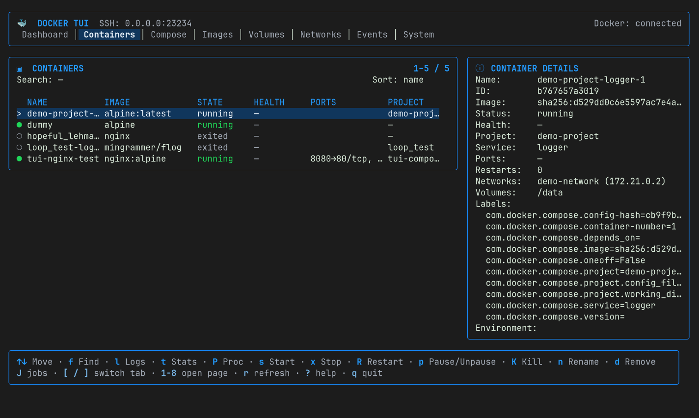
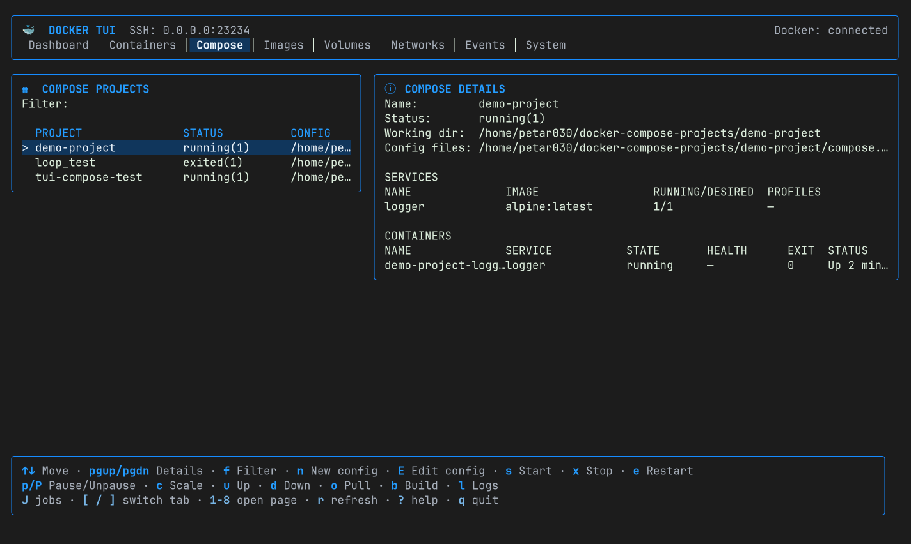
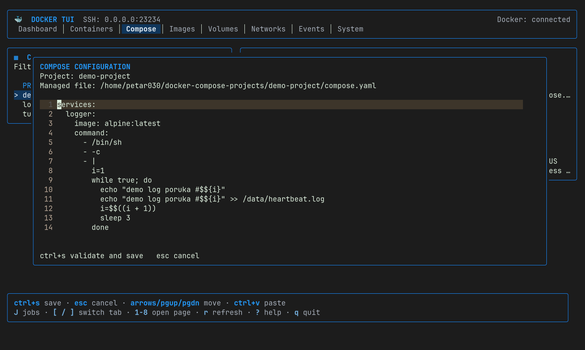
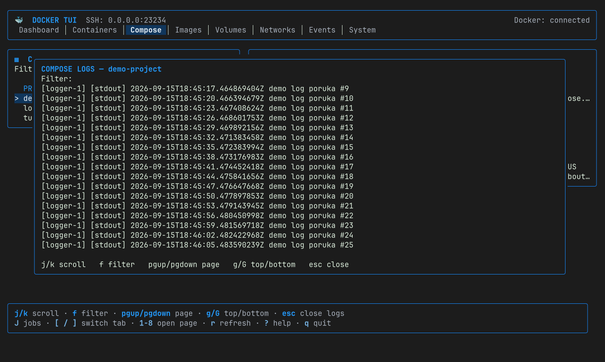
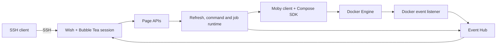

# SSH-Native Docker TUI

An SSH-served terminal interface for inspecting and managing a Docker Engine
without granting users a general-purpose shell account.

Each SSH connection receives an independent Bubble Tea session, while all
sessions share one process-wide backend and the same authoritative Docker
state. The application supports password and public-key authentication,
Docker Compose projects, live streams, asynchronous jobs, and guarded resource
operations.



## Highlights

- **SSH-native access** — connect with a standard SSH client; no browser or
  separate frontend is required.
- **Controlled administration** — users interact only with application
  operations, not the host command shell.
- **Docker resource coverage** — inspect and manage containers, images,
  volumes, networks, events, system data, and Compose projects.
- **Live feedback** — follow container logs and statistics, Compose logs,
  Docker events, and long-running job progress.
- **Multi-session consistency** — Docker remains the source of truth, and
  relevant updates are distributed to connected sessions.
- **Safe defaults** — unauthenticated operation is restricted to loopback;
  non-loopback listeners require password or SSH public-key authentication.
- **Guarded destructive operations** — prune and removal workflows require
  scoped filters or explicit confirmation where appropriate.

## Screenshots

<table>
  <tr>
    <td></td>
    <td></td>
  </tr>
  <tr>
    <td align="center"><strong>Containers</strong></td>
    <td align="center"><strong>Docker Compose projects</strong></td>
  </tr>
  <tr>
    <td></td>
    <td></td>
  </tr>
  <tr>
    <td align="center"><strong>Compose configuration</strong></td>
    <td align="center"><strong>Compose logs</strong></td>
  </tr>
</table>

## Requirements

- Go 1.26.3 or newer
- Docker Engine accessible to the server process
- An SSH client
- Git, when building from a clone

The server process needs permission to access the configured Docker endpoint.
With the default Docker setup, this usually means access to the local Unix
socket.

## Quick start

Clone the repository and enter the project directory:

```sh
git clone https://github.com/petar030/ssh-native-docker-tui.git
cd ssh-native-docker-tui
```

Open the local configuration interface:

```sh
go run ./cmd/ssh-docker-tui-config
```

The setup application configures the listen address, host key, authentication,
Docker endpoint, and allowed Compose roots. Configuration is stored in
`~/.ssh-docker-tui/config.json`; passwords are persisted only as bcrypt hashes.

Start the server:

```sh
go run ./cmd/ssh-docker-tui
```

Connect from another terminal using the configured port:

```sh
ssh -p 23234 localhost
```

For public-key authentication:

```sh
ssh -i ~/.ssh/id_ed25519 -p 23234 user@server
```

If no authentication method is configured, the application accepts only a
loopback listen address. Exposing the service on another interface requires at
least one configured password or authorized public key.

## Build

Build both executables locally:

```sh
mkdir -p bin
go build -o bin/ssh-docker-tui ./cmd/ssh-docker-tui
go build -o bin/ssh-docker-tui-config ./cmd/ssh-docker-tui-config
```

The main executable accepts optional non-secret overrides:

```text
-config PATH
-listen HOST:PORT
-host-key PATH
-docker-host ENDPOINT
-compose-root DIRECTORY   # repeatable
-dashboard-refresh DURATION
```

Authentication is intentionally configured through the setup application, not
command-line flags, to avoid leaking secrets through shell history.

## Interface

The main pages are:

| Page | Purpose |
| --- | --- |
| Dashboard | Engine availability, resource counts, disk usage, and recent events |
| Containers | Details, lifecycle actions, processes, logs, statistics, filters, and sorting |
| Compose | Project and service state, YAML editing, lifecycle commands, builds, pulls, and logs |
| Images | Details, history, tagging, pulling, removal, and guarded pruning |
| Volumes | Details, attachments, creation, removal, and guarded pruning |
| Networks | Details, connections, endpoint operations, creation, removal, and guarded pruning |
| Events | Filtered, bounded Docker event history and live updates |
| System | Engine information, disk usage, and guarded cleanup operations |

Use `[` and `]`, or keys `1`–`8`, to change pages. Press `?` for contextual
help, `r` to refresh the current page, `J` to open the session job tracker, and
`q` to disconnect. Page-specific operations are always shown in the footer.

## Architecture



The Go application is a modular monolith. UI state belongs to individual SSH
sessions; shared runtime components execute Docker work outside session event
loops. The backend does not maintain a second persistent copy of Docker
resource state. More detail is available in the
[backend documentation](docs/backend/README.md).

## Testing

Run formatting, static analysis, and unit tests:

```sh
make check
```

Run race-enabled unit tests:

```sh
make test-race
```

Run the real-Docker integration suite:

```sh
make test-integration
```

Integration tests create only labeled disposable resources and include guarded
cleanup behavior. Review the [testing guide](docs/testing.md) before running
tests against a shared Docker daemon.

## Project layout

```text
cmd/                         executable entry points
internal/backend/            page APIs and shared runtime components
internal/platform/           Docker and SSH adapters
internal/serverconfig/       persisted configuration and authentication
internal/setup/              local configuration TUI
internal/tui/                SSH-served Bubble Tea interface
test/                        reusable test suites and Docker fixtures
docs/backend/                architecture and runtime documentation
docs/screenshots/            images used by this README
```
